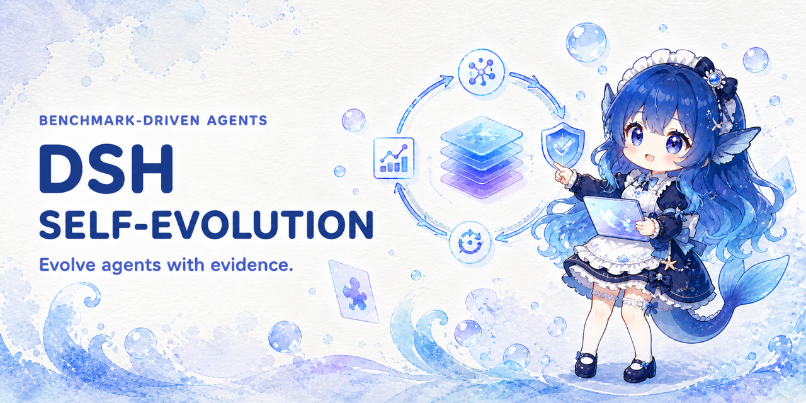

  <a href="README.md">简体中文</a> · <a href="README.en.md">English</a>

  

<h1 align="center">dsh-self-evolution</h1>

  
  
  

A benchmark-driven self-evolution plugin for DeepSeek Harness / Cordis. It lets an Agent Profile (AGENTS.md, Skills, runtime.json, and config) improve itself against a frozen Benchmark. A candidate is accepted only when it is strictly better than the current version; otherwise the engine restores a verified snapshot.

~~~text
Agent Profile v1
  ↓ frozen Benchmark
Target Subagents × Case × Run
  ↓
Private Evaluator Subagents
  ↓ score + public feedback + DeepSeek Session IDs
Isolated Optimizer Subagent
  ↓ bounded file operations
AGENTS.md / Skills / runtime.json / config
  ↓ Agent Profile v2
re-evaluate
  ├─ score strictly better → snapshot + accept
  └─ otherwise             → verified rollback
~~~

## Highlights

- **Native integration**: directly calls ctx.subagents.start(...) and ctx.tools.register(defineTool(...)) as a real Cordis Service, exposed as ctx.evolution rather than a shell wrapper.
- **Deterministic host policy**: frozen Benchmark hashes, the Case × Run matrix, strict acceptance, monotonic versions, and snapshot validation are enforced by host code rather than the LLM.
- **Three isolated roles**: Target inherits the Profile persona and tool scope; Evaluator sees private rubrics and raw output; Optimizer sees public evidence and has an empty inherited tool set with constrained file operations.
- **Privacy boundary**: private rubrics never enter Target or Optimizer context; public and private artifacts are stored separately.
- **Transactional changes**: candidate file allowlists, path-traversal and symlink protection, per-Profile locking, and external-change detection prevent unsafe rollback.
- **Traceability**: every sub-agent has its own DeepSeek Session ID, while Scoreboards and run logs make every decision auditable.
- **Plug and play**: declare a dsh.bundle profile bundle and install it with one dsh plugin command.

## Quick start

### Prerequisites

- An initialized DeepSeek Harness profile, with the dsh CLI and pnpm on PATH;
- the profile tools/subagents registries and the official spawn provider;
- an Agent Profile directory containing AGENTS.md and runtime.json;
- a frozen Benchmark directory outside the Target workspace.

### Install

This package is a DeepSeek Harness profile bundle. The dsh field in package.json points to cordis.patch.yml, so installation and activation happen together:

~~~bash
# Option 1: npm registry (recommended)
dsh plugin --profile web add dsh-self-evolution

# Option 2: install directly from GitHub
dsh plugin --profile web add github:Lhy723/dsh-self-evolution

# Option 3: local tarball
dsh plugin --profile web add ./dsh-self-evolution-0.1.0.tgz
~~~

Package: [dsh-self-evolution](https://www.npmjs.com/package/dsh-self-evolution), current version 0.1.0.

The plugin installs into the profile directory and appends its name to dsh.profile.bundles. At startup, its patch is applied after @deepseek-ai/dsh-base. Registry, Git, and tarball specs all reconcile to the real package name, so later dsh plugin ... update commands work normally.

> GitHub install note: this repository commits prebuilt dist/, so pnpm does not need a prepare build step or allowBuilds configuration for the Git dependency.

### Verify the installation

~~~bash
dsh --profile web --dump-config
~~~

The output should contain the bundle-injected section:

~~~yaml
# == dsh-self-evolution
- id: self-evolution
  name: dsh-self-evolution
  config:
    stateRoot: ~/.dsh/self-evolution
    subagentProvider: spawn
    ...
~~~

The installation is complete when the session exposes four evolution_* tools.

### First run

1. Copy examples/profile into the Agent workspace.
2. Copy examples/benchmarks/demo into a private directory outside the workspace.
3. Establish a baseline with an evaluation-only run:

   ~~~json
   {
     "profile_dir": "./agent-profile",
     "benchmark_dir": "/private/benchmarks/demo",
     "runs_per_case": 1
   }
   ~~~

4. After the Scoreboard contains a Baseline, run one evolution round:

   ~~~json
   {
     "profile_dir": "./agent-profile",
     "benchmark_dir": "/private/benchmarks/demo",
     "rounds": 1,
     "runs_per_case": 2
   }
   ~~~

Inspect accepted and rejected paths before considering unattended batch optimization.

## How it works

The plugin uses DeepSeek Harness primitives directly:

- **Target** is a first-class sub-agent that inherits the current Agent preset. AGENTS.md, Skills, and config become its persona, while runtime.json.toolFilter becomes its scoped Tool Restriction.
- **Evaluator** and **Optimizer** clear inherited tools, retaining only the tools temporarily registered for structured output.
- Every Target, Evaluator, and Optimizer receives an independent, traceable DeepSeek Session ID.
- The plugin registers model tools through ctx.tools.register(defineTool(...)) and exposes them as the Cordis Service ctx.evolution.

Deterministic host operations include Benchmark freezing and content hashes, the Case × Run matrix, candidate file allowlists and path protection, per-Profile locking and external-change detection, monotonic versions and snapshot validation, the strict improvement gate, accept/reject/manual rollback, and separation of public and private artifacts.

## Model tools

The default prefix is evolution; configure toolPrefix to change it.

| Tool | Purpose |
| --- | --- |
| evolution_run | Full loop: baseline → candidate generation → evaluation → strict accept or rollback |
| evolution_evaluate | Evaluate without modifying the Profile and append a durable reference |
| evolution_status | Show version, hashes, drift, Benchmark reference, and snapshots |
| evolution_rollback | Restore a verified version snapshot |

### evolution_run

~~~json
{
  "profile_dir": "./agent-profile",
  "benchmark_dir": "/private/benchmarks/code-review",
  "rounds": 3,
  "runs_per_case": 2,
  "baseline_runs": 1,
  "target_score": 85
}
~~~

target_score is optional and stops early once reached (0–100). adopt_external_changes: true can adopt manually edited managed Profile files as a new version instead of failing on digest drift.

### evolution_evaluate

~~~json
{
  "profile_dir": "./agent-profile",
  "benchmark_dir": "/private/benchmarks/code-review",
  "runs_per_case": 3
}
~~~

### evolution_status

~~~json
{ "profile_dir": "./agent-profile" }
~~~

### evolution_rollback

~~~json
{ "profile_dir": "./agent-profile", "version": 2 }
~~~

Rollback never reuses later candidate version numbers: if v4 is rejected or rolled back, the next candidate is still v5.

## Agent Profile

A Profile is an ordinary directory:

~~~text
agent-profile/
├── AGENTS.md
├── runtime.json
├── skills/
│   └── verification/
│       └── SKILL.md
└── config/
    └── quality-policy.md
~~~

| File | Role |
| --- | --- |
| AGENTS.md | Core behavior instructions for the Target Agent |
| skills/*/SKILL.md | Reusable capabilities; Optimizer may add, remove, or edit them |
| config/**/*.json\|md | Stable policies, format contracts, and domain configuration |
| runtime.json | The only machine-interpreted Profile file |

runtime.json:

~~~json
{
  "schemaVersion": 1,
  "version": 1,
  "agentOptions": {
    "maxTokens": 8192
  },
  "toolFilter": {
    "deny": ["schedule_create", "cordis_define"]
  },
  "metadata": {
    "owner": "agent-platform"
  }
}
~~~

| Field | Meaning |
| --- | --- |
| version | Current Profile version; rejected candidate numbers are never reused |
| agentOptions | provider, model, and maxTokens overrides for sub-agents |
| toolFilter | Scoped Tool Restriction: allow / deny |
| metadata | Ordinary JSON metadata ignored by the plugin |

Optimizer changes to provider and model are disabled by default so a model switch cannot be mistaken for a Profile improvement. Set allowModelRouteMutation: true to enable them. See examples/profile for a complete example.

## Benchmark

Benchmarks must declare frozen: true:

~~~text
benchmark/
├── benchmark.json
├── public/          # visible to Target
│   ├── concise-answer.md
│   └── verification.md
└── private/         # visible only to Evaluator
    ├── concise-answer.md
    └── verification.md
~~~

The manifest, public Statements, and private Rubrics all contribute to the Benchmark digest. A digest change before or after evaluation fails the entire round, and an existing Scoreboard rejects the same ID with a different digest. In production, keep the Benchmark—especially private rubrics—outside the Target workspace. The default allowBenchmarkInsideWorkspace: false rejects a workspace-local Benchmark. See examples/benchmarks/demo.

## Acceptance rules

A candidate is accepted only when all of the following are true:

1. The Optimizer produces valid, constrained file operations.
2. The Profile digest can be rebuilt after applying the Candidate.
3. The complete Case × Run matrix has valid scores.
4. The Benchmark digest is unchanged.
5. No other process modifies the Profile during evaluation.
6. candidate.score > reference.score + minImprovement.

**Ties roll back; >= is not used.** A Baseline can be reused only when the Benchmark digest, Profile version, and Profile digest all match.

## State and artifacts

Default state root:

~~~text
~/.dsh/self-evolution/
└── profiles/<sha256(real-profile-path)[0:24]>/
    ├── state.json
    ├── profile.lock
    ├── snapshots/
    │   ├── v1/
    │   └── v2/...
    ├── scoreboards/<benchmark-id>.json
    └── runs/<run-id>/
        ├── run.json
        ├── events.jsonl
        ├── public/          # Target output, scores, feedback, Session ID
        └── private/         # rubric and Evaluator private rationale
~~~

The Optimizer Prompt is built only from public evidence; private artifacts are never fed back into model context.

## Configuration reference

| Setting | Default | Description |
| --- | ---: | --- |
| stateRoot | ~/.dsh/self-evolution | Root directory for snapshots, Scoreboards, and run records |
| subagentProvider | spawn | Provider passed to ctx.subagents.start() |
| maxParallelEvaluations | 4 | Concurrent Case × Run cells |
| minImprovement | 0 | Extra score margin a Candidate must exceed |
| maxCandidateOperations | 12 | Maximum file operations per Candidate |
| maxCandidateBytes | 262144 | Maximum total UTF-8 bytes written |
| evaluationRetries | 1 | Extra attempts after a Target cell fails |
| evaluatorRetries | 2 | Extra Evaluator attempts for the same Target output |
| optimizerRetries | 1 | Extra Optimizer attempts after an invalid Candidate |
| lockStaleMs | 1800000 | Expiration threshold for a stale Profile lock |
| allowBenchmarkInsideWorkspace | false | Allow private Benchmarks inside the Target workspace |
| allowModelRouteMutation | false | Allow Candidates to change provider/model |
| managedFiles | See source | Globs that may be modified/snapshotted |
| excludedFiles | See source | Secret and non-state globs excluded from management |
| requiredFiles | AGENTS.md, runtime.json | Files that must not be deleted |
| toolPrefix | evolution | Prefix for the four tool names |
| maxDepth | 4 | Maximum sub-agent delegation depth |

## Security boundary

The plugin guarantees context and file transaction boundaries, not a new OS sandbox:

- Rubrics never enter Target or Optimizer Prompts;
- inherited tools are cleared for Evaluator / Optimizer;
- Candidates cannot write absolute paths, parent traversal, symlink paths, secret globs, or unmanaged files;
- Profile drift prevents rollback from overwriting external changes.

If a Target sub-agent inherits an escape-capable tool such as danger-full-access shell, it may still search host files outside the workspace. When private rubrics are highly sensitive, also use the harness workspace sandbox / filesystem policy or remove escape-capable tools in runtime.json.toolFilter. See SECURITY.md.

## Model and token impact

- **Tool surface**: four tools, each with roughly 1 KB of schema description.
- **Sub-agent fan-out**: one evolution_run makes approximately rounds × cases × (runs_per_case × (1 target + 1 evaluator) + 1 optimizer) + baseline model calls.
- **Context injection**: Target receives the full Profile persona; Optimizer receives public evidence and the managed Profile; private rubrics and evaluation notes do not enter model context.
- **Deterministic overhead**: digests and snapshots are local hashing/file operations; concurrency is bounded by maxParallelEvaluations.

## Known limitations

- Live E2E with model credentials has not been run; runtime.json.toolFilter was checked against rc.6 types but not live-verified.
- The plugin provides context and file transaction boundaries, not an OS sandbox.
- evolution_status and evolution_rollback need an Agent context and return MISSING_AGENT otherwise.
- Per-Profile locking uses profile.lock and lockStaleMs; cross-host concurrency is out of scope.

## Development and verification

~~~bash
npm run build                          # strict build against @deepseek-ai/*@rc.6 declarations
node scripts/smoke-register.mjs        # real dsh-tools / dsh-invariants smoke test
dsh --profile <name> --dump-config     # real launcher bundle composition check
npm pack                               # create the release tarball
~~~

Verification has two layers:

1. **Real type build** against published @deepseek-ai/*@0.1.0-rc.6 declarations.
2. **Real runtime smoke test** for the four tools, invariant companion registration, fiber disposal, and launcher bundle composition.

The only unrun check is an end-to-end run with model credentials. See COMPATIBILITY.md and BUILD_REPORT.md for acceptance steps and the complete build record.

## Contributing

Issues and PRs are welcome. Run the verification commands above after source changes; commit dist/ together with source because Git installs use the prebuilt artifacts.

## License

[MIT](LICENSE)
